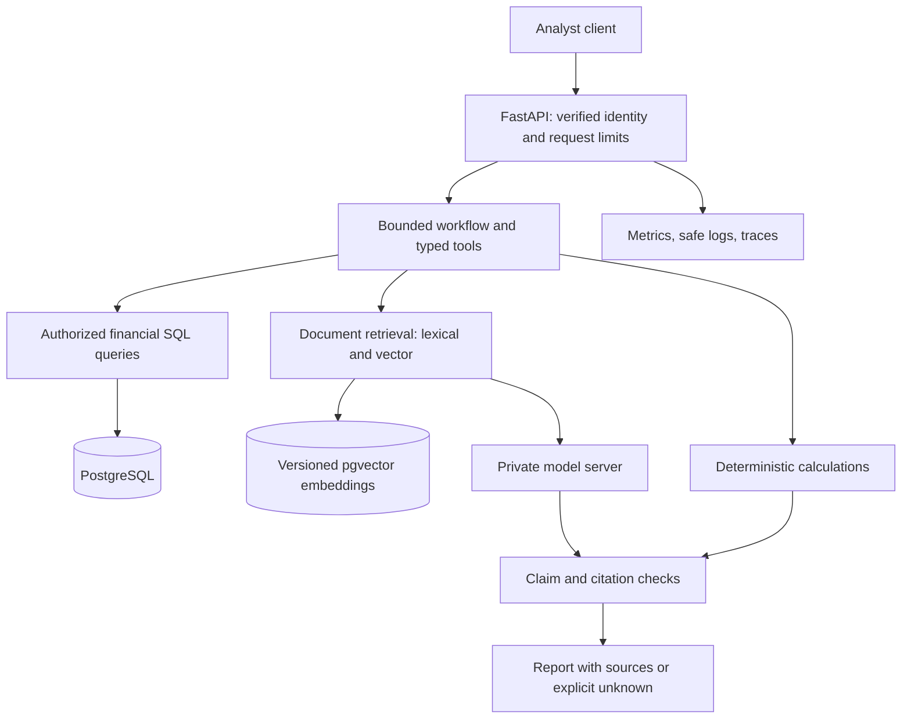

# Capstone — private financial research platform

Build a system that compares fictional companies’ financials using authorized records and traceable documents. Then demonstrate the same architecture on data you are permitted to use. The deliverable is an independently built, evaluated, reproducible application plus an explanation of its limits.

## User story

An authenticated analyst asks: “Compare Aurora and Beacon over 2023–2025: revenue, operating margin, and free cash flow. Show the evidence.” The system scopes access, retrieves the correct periods, computes values in code, produces a comparison, and cites source versions. If a period or permission is missing, it says so explicitly.

## Architecture

Mark trust boundaries and timeouts on your own version. Model output proposes text/actions; it does not grant database privileges.

## Milestones and acceptance evidence

| Milestone | Required behavior | Proof |
|---|---|---|
| 1. Data | Typed financial rows, source IDs, publication times, units; document parsing with provenance | Reconciled fixture values, bad-row tests, parser inspection |
| 2. API | Verified users/roles/tenant scope, validation, bounded requests, persistent data | HTTP tests and restart test |
| 3. Retrieval | Learned embeddings, keyword search, hybrid fusion, metadata filters, reranking | Same labeled questions, recall/MRR/latency comparison |
| 4. Tools | Named SQL operations, search, calculator, optional read-only external data adapter | Valid/invalid args, tool traces, explicit unavailable-data outcomes |
| 5. Orchestration | Bounded calls/time, errors/retries, scoped state, exact-action approval where needed | Failure cases, stopped loop, rejected altered approval, isolated threads |
| 6. Generation | Local model, structured output, cited claims, unsupported-answer behavior | Real serving run plus human-reviewed claim support |
| 7. Operations | Docker, private networking, health/readiness, secrets, logs/metrics/traces, backups, CI | Deployment reproduction, restore and rollback drills |
| 8. Security | Authorization before retrieval/tools, scoped caches, output handling, limits | Positive/negative access matrix and adversarial report |
| 9. Evaluation | At least 100 curated questions initially, expanding toward 500 with domain coverage | Versioned dev/holdout sets, slice reports, paired comparisons, release gates |
| 10. Defense | Explain, debug, and extend the system independently | 90-minute unseen task, oral review, delayed reassessment |

Suggested 90-hour capstone budget: design/data 10, independent implementation/integration 35, evaluation/security 20, operations/failure drills 15, documentation/defense 10. Earlier stages supply prerequisite components. Increase time when a checkpoint is weak.

## Reference artifacts and expected answer

- [API](../projects/api.py) and [repository/evidence baseline](../projects/reference.py): authenticated local HTTP endpoints, SQLite/PostgreSQL selection, ingestion, exact financial comparison, lexical evidence.
- [Six-row comparison demo](../projects/stage15/solution.py): a runnable numeric answer.
- [Embedding/vector/reranking/model integration](../projects/stage07/integration.py): a genuine external-service path that needs setup and independent evaluation.
- [LangGraph approval example](../projects/stage08/solution.py), [local model client](../projects/stage09/serve.py), [evaluation harness](../projects/stage13/solution.py), [runbook](../projects/stage10/RUNBOOK.md), and [tests](../tests/test_projects.py).

| Company | Year | Revenue, million USD | Operating margin | FCF, million USD |
|---|---:|---:|---:|---:|
| Aurora | 2023 | 100 | 15% | 13 |
| Aurora | 2024 | 120 | 20% | 18 |
| Aurora | 2025 | 144 | 25% | 24 |
| Beacon | 2023 | 90 | 10% | 8 |
| Beacon | 2024 | 99 | 12.1212…% | 9 |
| Beacon | 2025 | 108 | 13.8888…% | 12 |

Cite `aurora-YEAR` or `beacon-YEAR` for each row and report the filing publication time. Percentages are presentation values; retain Decimal precision for calculations. Do not call these fictional figures investment research about real companies.

## What the reference does not certify

The baseline is deliberately small: shared tenant demo API keys, process-local rate limiting, a lexical evidence endpoint, initial-schema setup, nine smoke evaluation cases, and no deployed external identity provider or monitoring backend. Optional integrations are executable labs, not automatically running services. The reference does not certify prompt-injection immunity, production scalability, model quality, high availability, or a complete deployment.

Your capstone must connect and test the full system, implement the missing operational controls, expand and review evaluation labels, and document the exact behavior of external integrations. Do not mark production gates passed because a simplified local substitute works.

## Failure matrix

Test database unavailable, model unavailable, timeout, invalid auth, insufficient permission, malicious document, corrupted parse, missing period, mismatched currency/units, stale index, huge prompt, repeated tool loop, revoked access with a warm cache, and failed restore. Record trigger, expected result, actual result, trace/request ID, recovery, and regression test.

## Portfolio and final defense

Submit a concise README, architecture decisions, reproducible setup, code/tests, data provenance, model cards, evaluation report, threat model, runbook, incident write-up, and a short demo. Preserve the other three portfolio projects: ticket classifier, image classifier, and private document assistant.

Pass the [mastery rubric](assessments/MASTERY.md) at 80/100 with every critical gate satisfied. Have someone else reproduce the application and ask you to change a requirement. Revisit after 7 and 30 days; confidence after studying a solution is less informative than successful delayed independent work.
